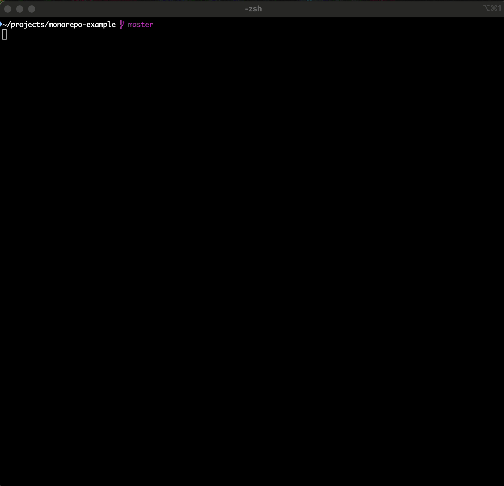

# node-run

An fzf-like npm script runner with monorepo support. 🦋



🚩 Lightning fast ⚡️

🚩 Supports all popular package managers:

- npm ✅
- pnpm ✅
- yarn ✅
- Bun ✅

🚩 Executable from any project subdirectory 🔥 🔥 🔥

## Installation

```sh
> brew tap silesky/tap && brew install node-run
```

## Usage

```sh
> cd ~/my-projects/my-node-app
> nrun
```

### Flags

```
> nrun --help

Usage: nrun [options] [search-input]
Example:
- nrun
- nrun my-search-string
Options:
  --cwd
        Specify current working directory
  --debug
        Turn debug logging on
  --help
        Show help text
  --version
        Show version
```
